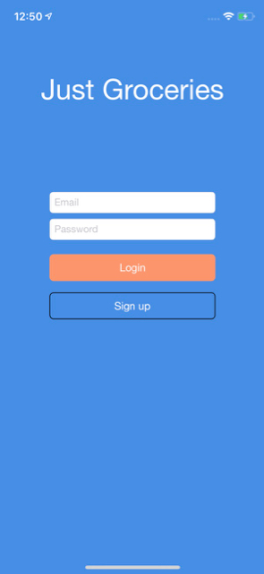
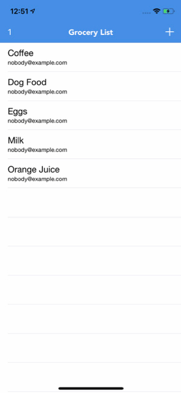
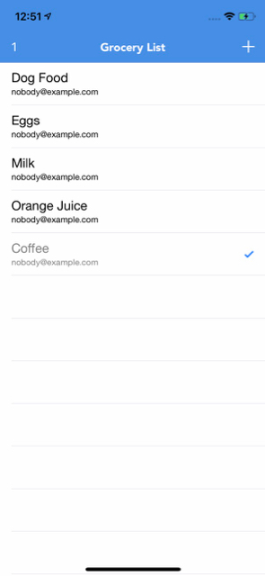
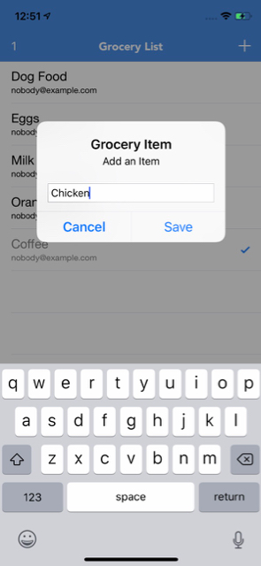
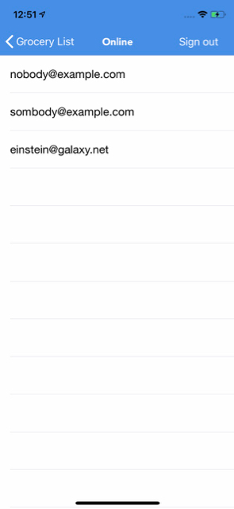
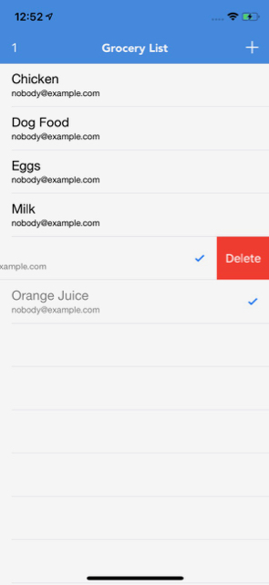

# Just Groceries

## Overview

This is a grocery list application that uses firebase to store and sync grocery list items.  I plan to grow it to be a full fledge application with iOS and Web versions.  Test deleting this sentence directly to master.

## Screenshots

### Todo
* Add user authentication
* Add face id and fingerprint for login
* Add multiple grocery lists
* Add ability to share a list with other users
* Golden/Family list allowing simple version of app to quickly add items by others without going through muliple steps
* Integrate with Alexa devices
